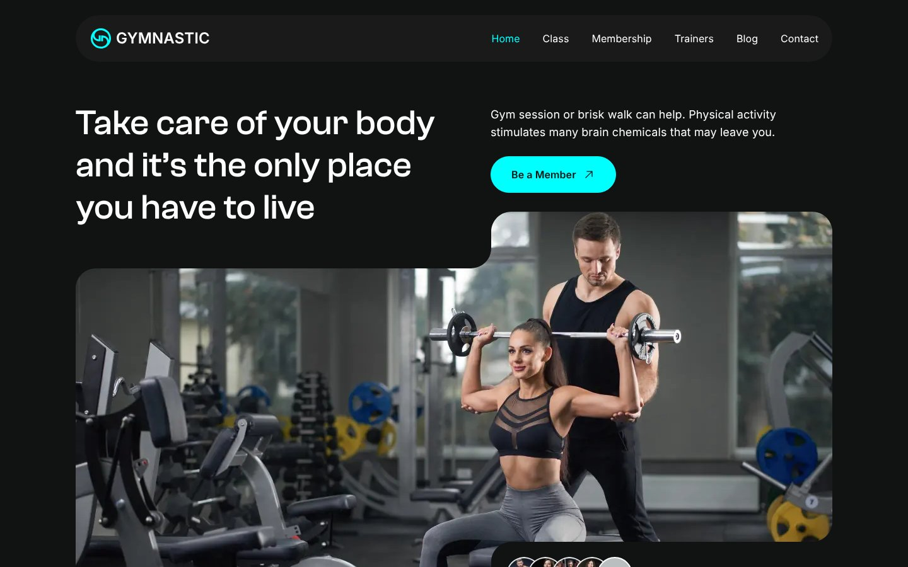

<div align="center">

# Gymnastic — Fitness & Gym Training Website (Next.js + Tailwind CSS)

A bold, modern **gym / fitness training website template** with classes, memberships and trainer profiles — designed in Figma and built with Next.js, TypeScript and Tailwind CSS.

[](https://fitness-training-website-bay.vercel.app)




</div>

## ✨ Features

- ✅ High-impact gym hero with membership CTA
- ✅ Class schedule, membership plans and trainer profiles
- ✅ Blog and contact sections
- ✅ Dark theme with neon-cyan accent colour system
- ✅ Responsive layout for mobile, tablet and desktop
- ✅ Optimised images and SEO-friendly semantic HTML

## 🛠 Tech Stack

Next.js (App Router) · TypeScript · Tailwind CSS · React · Vercel

## Getting started

```bash
npm install
npm run dev
```

Open http://localhost:3000.

```bash
npm run build   # production build
npm run lint
```


---

## 👤 Designer & Developer

**Noor Hossain** — UI/UX Designer & Front-End Developer (Next.js, React, Tailwind CSS) based in Dhaka, Bangladesh. I design in Figma and ship pixel-perfect, responsive, SEO-friendly websites.

[](https://github.com/nooruiux)
[](https://www.linkedin.com/in/noorxtk/)
[](https://www.behance.net/noorxtk)
[](https://dribbble.com/Noorxtk)

💼 **Available for freelance:** landing pages, SaaS websites, Figma-to-Next.js builds, UI/UX design. ⭐ Star this repo if it helped you.

<sub>Keywords: gym website template, fitness website design, personal trainer website, Next.js fitness template, Tailwind CSS gym landing page, health club website, Figma to code, UI/UX design, responsive web design.</sub>
